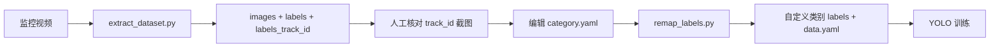

# TrackRemap

**TrackRemap** — 基于追踪 ID 的 YOLO 视频标注与类别重映射工具。

基于 YOLO 目标检测与 ByteTrack 追踪，从监控视频自动抽帧并生成 YOLO 格式数据集；再通过 `track_id` 将通用检测类别（如 person）映射为**任意自定义细分类别**，适用于人员计数、着装/工装识别、岗位分组、行为场景分类等多种任务。

> 本仓库当前以「工装分类」为示例配置，类别名称与数量均可通过 `category.yaml` 自由定义，不限于工装场景。

## 适用场景示例

| 场景 | 自定义类别举例 |
|------|----------------|
| 工装识别 | 工装 A / 工装 B / 便装 |
| 岗位分组 | 操作工 / 质检 / 访客 |
| 区域人员 | 红区 / 绿区 / 未授权 |
| 其他 | 任意需对同类型目标（如 person）做细分的任务 |

核心思路：先用检测模型统一框出目标，用追踪 ID 跨帧关联同一人，再人工对照截图将各 `track_id` 归入自定义类别。

## 项目结构

```
TrackRemap/
├── extract_dataset.py      # 从视频抽帧并生成初始标注
├── remap_labels.py         # 按 track_id 将标签映射为自定义类别
├── category.yaml           # 自定义类别与 track_id 映射配置
├── a.mp4                   # 输入视频（可在脚本中修改）
├── yolo11n.pt              # YOLO 预训练权重
└── dataset/
    ├── data.yaml           # YOLO 数据集配置
    ├── images/train/       # 抽帧图像（000000.jpg …）
    ├── labels/train/       # YOLO 标签（映射后的自定义类别）
    ├── labels_track_id/
    │   ├── train/          # 含 track_id 的中间标签
    │   └── id/             # 各 track_id 首帧目标截图
    └── annotated_track.mp4 # 带 track_id 标注的可视化视频
```

## 工作流程



1. **抽帧与追踪**：`extract_dataset.py` 对视频逐帧运行 YOLO11 + ByteTrack，检测指定 COCO 类别（默认 `person`，class 0），保存图像与 YOLO 标签。
2. **核对 track_id**：查看 `dataset/labels_track_id/id/` 下各 track 的首帧截图，确认每个目标对应的 `track_id`。
3. **配置类别映射**：在 `category.yaml` 中定义任意数量的自定义类别，并将 `track_id` 关联到对应类别。
4. **重映射标签**：`remap_labels.py` 读取 `labels_track_id`，按 bbox 坐标匹配并将类别写入 `labels/train`，同时更新 `data.yaml` 中的 `names`。

## 环境依赖

- Python 3.10+
- [Ultralytics YOLO](https://github.com/ultralytics/ultralytics)
- OpenCV
- tqdm
- PyYAML

```bash
pip install ultralytics opencv-python tqdm pyyaml
```

## 使用方法

### 1. 准备输入

将待处理视频放在项目根目录（默认文件名 `a.mp4`），并确保存在 YOLO 权重文件（默认 `yolo11n.pt`）。可在 `extract_dataset.py` 顶部修改：

```python
VIDEO = "a.mp4"
MODEL = "yolo11n.pt"
EXPORT_TRACK_ID = True  # 是否导出 track_id 标签与注释视频
```

如需检测其他 COCO 类别，修改 `model.track()` 中的 `classes` 参数（默认 `[0]` 即 person）。

### 2. 抽取数据集

```bash
python extract_dataset.py
```

输出包括：

| 路径 | 说明 |
|------|------|
| `dataset/images/train/` | 每帧 JPG 图像 |
| `dataset/labels/train/` | 初始标签，类别均为检测模型的原始 class（默认 `0` = person） |
| `dataset/labels_track_id/train/` | 格式：`class cx cy w h track_id` |
| `dataset/labels_track_id/id/` | `{track_id}_{class_name}.jpg` 目标截图 |
| `dataset/annotated_track.mp4` | 带 track_id 标注的视频 |
| `dataset/data.yaml` | YOLO 数据集配置（初始仅含检测类别） |

### 3. 配置自定义类别

编辑 `category.yaml`。每个条目包含：

| 字段 | 说明 |
|------|------|
| 键名（如 `workwear1`） | 类别标识，会写入 `data.yaml` 的 `names` |
| `type` | 中文/可读名称，便于人工识别 |
| `classes` | YOLO 类别 ID，从 0 起连续编号 |
| `track_id` | 属于该类别的追踪 ID 列表 |

**配置规则：**

- 类别数量不限，按需增删条目。
- `classes` 建议从 0 起连续递增，避免训练时 ID 冲突。
- 每个 `track_id` 只能归属一个类别；未出现在任何 `track_id` 列表中的目标，会归入默认类别（键名为 `noworkwear` 的条目，见下方说明）。
- 键名可自定义（如 `group_a`、`visitor`），仅 `noworkwear` 作为「未匹配 / 其他」的保留键名被 `remap_labels.py` 识别。

**当前示例（工装场景）：**

```yaml
workwear1:
  - type: 工装1
  - classes: 0
  - track_id: [1]
workwear2:
  - type: 工装2
  - classes: 1
  - track_id: [12, 14, 17, 22]
workwear3:
  - type: 工装3
  - classes: 2
  - track_id: [13]
workwear4:
  - type: 工装4
  - classes: 3
  - track_id: []
noworkwear:
  - type: 其他
  - classes: 4
  - track_id: []
```

**其他场景示例（岗位分组）：**

```yaml
operator:
  - type: 操作工
  - classes: 0
  - track_id: [1, 3, 7]
inspector:
  - type: 质检员
  - classes: 1
  - track_id: [2, 5]
visitor:
  - type: 访客
  - classes: 2
  - track_id: [4]
noworkwear:
  - type: 未识别
  - classes: 3
  - track_id: []
```

> `noworkwear` 键名表示默认兜底类别，`type` 可改为「其他」「未识别」等任意描述；若改用其他键名，需同步修改 `remap_labels.py` 中的 `load_default_class`。

### 4. 重映射标签

```bash
python remap_labels.py
```

脚本会：

- 读取 `labels/train` 与 `labels_track_id/train` 中相同 bbox 的行
- 根据 `category.yaml` 将初始检测类别（默认 `0`）替换为对应自定义类别
- 更新 `dataset/data.yaml` 中的 `names` 字段

映射完成后，`data.yaml` 会反映你在 `category.yaml` 中定义的全部类别，例如：

```yaml
names:
  0: workwear1
  1: workwear2
  2: workwear3
  3: workwear4
  4: noworkwear
```

### 5. 训练 YOLO

```bash
yolo detect train data=dataset/data.yaml model=yolo11n.pt epochs=100 imgsz=1280
```

## 标签格式

**标准 YOLO 标签**（`labels/train/`）：

```
<class_id> <x_center> <y_center> <width> <height>
```

坐标均为相对图像宽高的归一化值（0–1）。

**含 track_id 的中间标签**（`labels_track_id/train/`）：

```
<class_id> <x_center> <y_center> <width> <height> <track_id>
```

## 当前示例类别（工装场景）

以下仅为本仓库现有 `category.yaml` 的配置，可按需完全替换：

| ID | 键名 | 说明 |
|----|------|------|
| 0 | workwear1 | 工装 1 |
| 1 | workwear2 | 工装 2 |
| 2 | workwear3 | 工装 3 |
| 3 | workwear4 | 工装 4 |
| 4 | noworkwear | 其他 / 未匹配 |

具体 `track_id` 与类别对应关系以 `category.yaml` 为准。

## 注意事项

- `extract_dataset.py` 默认对**每一帧**都保存样本；数据量等于视频帧数，可按需在脚本中加入采样间隔。
- 追踪 ID 在遮挡、出画后可能变化，映射前请结合 `labels_track_id/id/` 截图人工核对。
- 更换场景时，只需重写 `category.yaml` 并重新运行 `remap_labels.py`，无需修改抽帧脚本。
- `.gitignore` 已忽略大体积产物（图像、track_id 标签、注释视频、权重等）；提交代码时通常保留 `category.yaml`、脚本及映射后的 `labels`。
- 当前 `data.yaml` 中 `val` 与 `train` 指向同一路径，正式训练建议划分独立验证集。

## 当前数据规模

- 训练图像 / 标签：约 360 帧（`000000`–`000359`）
- 输入视频：`a.mp4` 及同目录其他片段可用于扩展数据集
